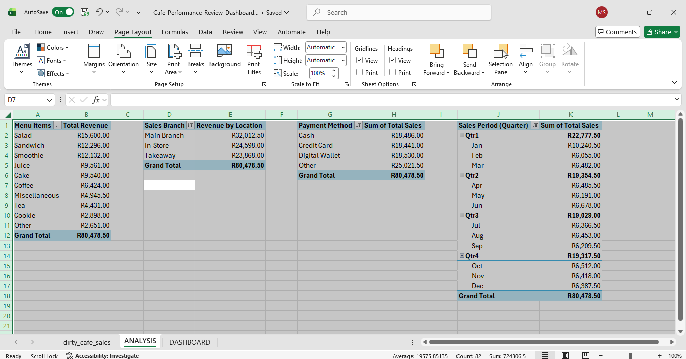
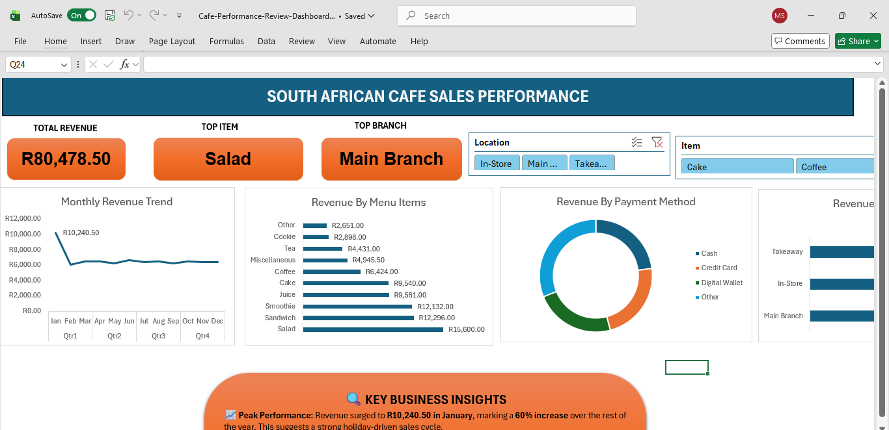

☕ South African Cafe Sales Analysis (Portfolio Project)

A full-cycle data analysis project focused on cleaning and transforming "dirty" cafe sales data into actionable business insights using Excel and Power Query.

📊 Phase 1: Data Cleaning & Transformation (COMPLETED)
In this phase, I handled real-world "dirty" data to ensure accuracy for a local South African business.

🧹 Cleaning Steps Taken:

Item Standardisation: Fixed "ERROR" and "UNKNOWN" values in the Item column and used Capitalise Each Word for a professional look.

Financial Audit: Identified that the original "Total Spent" column had logical errors. I created a new Total Sales column using the formula [Quantity] * [Price Per Unit] to ensure 100% accuracy.

Handling Missing Data: Replaced empty cells and null values with "Unknown" (for text) and "0" (for numbers) to prevent math errors.
Localization (ZAR): Converted all monetary values to South African Rand (R).

Date Formatting: Resolved American (MDY) vs. South African (DMY) date conflicts to ensure correct time-series analysis.

📊 Phase 2: Data Analysis & Pivot Tables

In this phase, I moved from data cleaning to deep-dive analysis using Excel Pivot Tables to answer key business questions:

Trend Analysis: Grouped dates into months to identify the R10.2k January peak.

Product Performance: Categorised items to discover that "Salads" are the #1 revenue driver.

Financial Summarisation: Calculated total revenue (R80,478.50) and broke it down by branch and payment method.

🛠️ Tools Used Power Query: For Extract, Transform, and Load (ETL) processes.

Excel: For financial calculations and localization.

GitHub: For project documentation and version control.

📊 Phase 3: Interactive Dashboard & Insights (COMPLETED)

In the final phase, I developed a dynamic dashboard to translate raw numbers into visual stories.

Interactive Features:Dynamic Slicers: Integrated Location and Item filters that allow stakeholders to drill down into specific branches or products.

Visual KPIs: Created "at-a-glance" scorecards for Total Revenue (R80k), Top Product (Salad), and Top Branch (Main Branch).

Time-Series Analysis: A smoothed line chart highlighting seasonal trends and the January peak.

💡 Strategic Business Insights:

Seasonality: Identified a 60% revenue spike in January, suggesting the cafe is a major holiday destination.

Menu Optimization: Discovered that Healthy Lunch items (Salads/Sandwiches) generate 50% of total revenue, making them the core of the business.

Data Quality Recommendation: Highlighted that 31% of revenue is currently categorized as "Other." I recommend a deeper audit into this category to better track fees associated with 3rd-party delivery apps like Uber Eats or Mr D.

🛠️ Skills Demonstrated:Excel Dashboarding: Advanced charting, shape-linking, and UI/UX design.

Interactivity: Slicer implementation and Report Connections.

Business Communication: Translating complex charts into actionable executive summaries.

